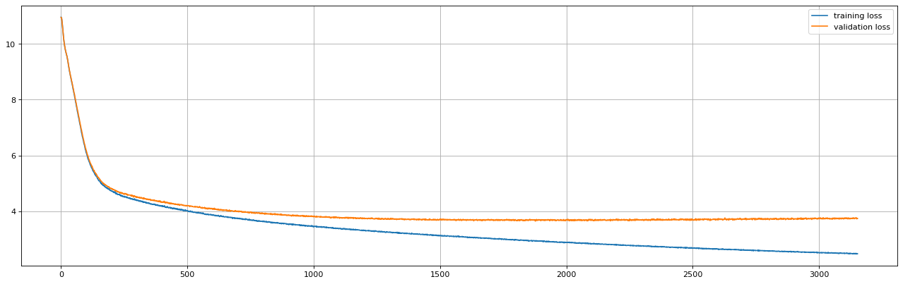

# BrandoSandoGPT

Based on [Andrej Karpathy's nanoGPT](https://github.com/karpathy/nanoGPT) this is a GPT model that generates text in the style of the author Brandon Sanderson. It requires the same dependancies listed below.

Texts available to train from:
- The Way of Kings
- Words of Radiance
- Edgedancer
- Oathbringer
- Dawnshard
- Rhythm of War
 
with more on the way!
<br />  
<br />
## Dependencies:

- [pytorch](https://pytorch.org)
- [numpy](https://numpy.org/install/)
- `pip install transformers` for huggingface transformers (to load GPT-2 checkpoints)
- `pip install datasets` for huggingface datasets (if you want to download + preprocess OpenWebText)
- `pip install tiktoken` for OpenAI's fast BPE code
- `pip install wandb` for optional logging
- `pip install tqdm`
<br />

## Training Guide

### 1. Prepare the tokenized dataset by running
```
$ python3 Brandon_Sanderson/Stormlight/prepare.py {name of book here}
```
If no book name is provided it defaults to using all Stormlight books as text to train on, otherwise the following options lets you select which book to train on:
- `twok`
- `wor`
- `o`
- `row`
- `dawn`
- `edge`

Note: If you want to train the model on a specific subset of the books, call 
```
python3 Brandon_Sanderson/Stormlight/append_file.py --output_file.txt --book1.txt --book2.txt --book3.txt
```

<br />  

### 2. Train the model 

On lighter machines (i.e. laptops, macbooks) the model can only be trained on smaller paramaters
```
$ python train.py config/train_char.py --device=cpu --compile=False --eval_iters=20 --log_interval=1 --block_size=64 --batch_size=12 --n_layer=4 --n_head=4 --n_embd=128 --max_iters=2000 --lr_decay_iters=2000 --dropout=0.0
```
or on heavier machines, we can use the full set
```
$ python3 train.py config/train_char.py
```
<br />  
<br />  

Loss graph after ~3000 iterations trained with `--batch_size=8 --n_layer=8 --n_head=8 --n_embd=512 --block_size=512`, approximately 50M params:



Minimal validation loss occurs at iteration 1877 with a validation loss of 3.641. The validation loss was roughly constant after 1500 iterations, but not bad nevertheless.

<br />  

### 3. Finally, sample from the model
```
$ python3 sample.py --out_dir=out-sanderson-char
```
and sample paragraphs will be generated to the command line.

Using the model I trained above here are some outputs I got:

```
Their powers  will  become the same.” Kaladin didn’t know how much 
of this could be a power to protect such, but it was a good weapon. 
“The chance we could get through without Shards.” She stopped in place, 
then glanced at Elhokar. “I’ll be expecting this to manipulate the 
enemy, Elhokar.” “No,” Kaladin said, then scratched his head. “I will 
send men to help.” Kaladin looked over his shoulder.
```
```
Dalinar didn’t want to handle it. “What do you think of this?” “And 
my vision,” Jasnah said, “to give you your way.” Jasnah shook her 
head. “Why did you  let me be allowed to be a little time?” “Whatever 
you’d had expected.” “What?” “Because I didn’t. You wish to be Jasnah.” 
Dalinar closed his eyes, feeling awkward. She felt cold, then sighed 
and walked back to Dalinar. “I’m sorry.” “Go,” Jasnah said, Stormlight 
leaking from the floor. Jasnah sighed as he stalked through the crowd, 
but Navani led the way to a small group of men on the eastern gallery, 
where scouts were waving orders against the Shattered Plains. “You 
will start with me, child,” Dalinar said.
```
```
These were the same, though she’d never seen anything like those in 
Alethkar. The Fused who had been hiding in Urithiru. They’d been set 
up on the Oathgates; the other red eyes were gone … well, it was 
growing thicker than the Alethi ones before. The red eyes began to pass. 
“These are unimportant,” Elhokar said to her, sounding troubled. “They 
are our true ancestors. They are new.” He pointed to Shallan. “They are 
our leader,  Shallan.”
```

It can't really keep a plotline at this level of training, and not all the sentences are gramatically correct. But it definitely knows the characters, roughly the right language and can distinguish the Fused from the Radiants. So overall not bad, and much better than training on a laptop CPU.

#

#### TODO:
- reduce loss??
- webpage with good model?
- train on cloud servers
